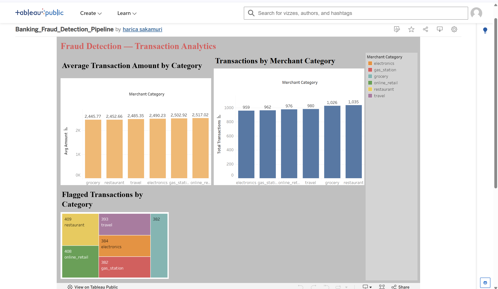

# Banking Fraud Detection Pipeline

An end-to-end streaming data pipeline that simulates banking transactions, detects potentially fraudulent activity in real time, and surfaces the results in an interactive dashboard.

**Live dashboard: https://public.tableau.com/app/profile/harica.sakamuri5434/viz/Banking_Fraud_Detection_Pipeline/BankingFraudDetectionTransactionAnalytics
## Architecture

```
Python (synthetic transactions) 
    → Kafka (Docker) 
        → Spark Structured Streaming (fraud rule engine) 
            → AWS S3 (raw + flagged zones) 
                → AWS Athena (SQL query layer) 
                    → Tableau Public (dashboard)
```

- **producer.py** — generates realistic fake transactions (amount, merchant category, location, card ID) using Faker, and streams them into a Kafka topic once per second.
- **fraud_detector.py** — a Spark Structured Streaming job that consumes the Kafka topic, applies a fraud rule (flags any transaction over $3,000), and writes both the full stream and the flagged subset to separate S3 locations as Parquet.
- **AWS S3** — acts as the data lake, storing `raw/` (all transactions) and `flagged/` (fraud-flagged transactions) in Parquet format.
- **AWS Athena** — external tables (`fraud_db.raw_transactions`, `fraud_db.flagged_transactions`) defined directly over the S3 data for SQL querying, no data warehouse required.
- **Tableau Public** — dashboard built from Athena query exports, visualizing transaction volume, average transaction amount, and flagged transactions by merchant category.

## Tech Stack

- **Streaming:** Apache Kafka (via Docker), Apache Spark Structured Streaming
- **Cloud:** AWS S3, AWS Athena, AWS Glue (Data Catalog)
- **Languages:** Python (PySpark, kafka-python, Faker, boto3)
- **Visualization:** Tableau Public
- **Infra:** Docker Compose

## Setup

### Prerequisites
- Python 3.11
- Docker Desktop
- Java 17 (for Spark)
- AWS account with an S3 bucket and IAM user with S3/Athena permissions

### 1. Clone and set up the environment
```
git clone https://github.com/sakamuriharica2003/banking-fraud-detection-pipeline.git
cd banking-fraud-detection-pipeline
py -3.11 -m venv venv
venv\Scripts\activate
pip install kafka-python faker boto3 pyspark
```

### 2. Start Kafka
```
docker-compose up -d
docker exec -it <fraud-detection-pipeline-kafka-1> kafka-topics --create --topic transactions --bootstrap-server localhost:9092 --partitions 1 --replication-factor 1
```

### 3. Configure AWS
Update the bucket name and region inside `fraud_detector.py` to match your own S3 bucket, then set your credentials as environment variables:
```
$env:AWS_ACCESS_KEY_ID="your_access_key"
$env:AWS_SECRET_ACCESS_KEY="your_secret_key"
```

### 4. Run the pipeline
In one terminal:
```
python producer.py
```
In a second terminal:
```
spark-submit --packages org.apache.hadoop:hadoop-aws:3.5.0,org.apache.spark:spark-sql-kafka-0-10_2.13:4.2.0 fraud_detector.py
```

### 5. Query with Athena
Create external tables pointing at your S3 `raw/` and `flagged/` prefixes, then query directly with SQL — see `fraud_detector.py` for the schema used.

## Dashboard



The dashboard includes:
- **Transaction volume by merchant category** (bar chart)
- **Average transaction amount by merchant category** (bar chart)
- **Flagged transactions by category** (treemap)

## Future Improvements

This project is built to be extended incrementally:
- **Orchestration:** Apache Airflow to schedule and monitor the pipeline instead of running scripts manually
- **Transformations:** dbt for cleaner, testable, version-controlled SQL transformations
- **Smarter fraud rules:** geo-velocity detection (same card used in distant locations within minutes), rapid repeat transaction detection
- **Machine learning:** anomaly scoring model instead of a static dollar-amount threshold
- **Data quality:** Great Expectations or dbt tests on the pipeline output
- **CI/CD:** GitHub Actions to automate testing and deployment of pipeline changes

## Author

Built by [Harica Sakamuri](https://github.com/sakamuriharica2003) as a portfolio project while pursuing Data Engineer roles.
